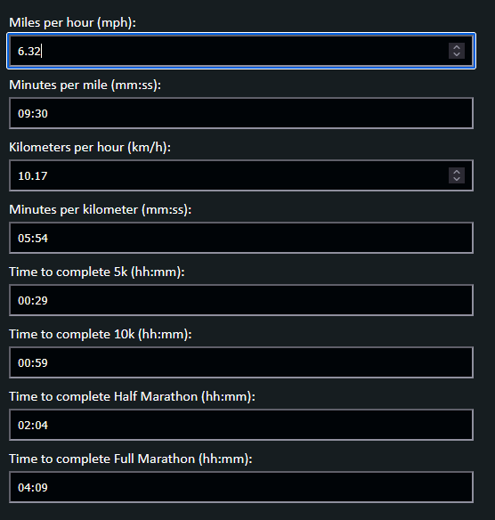

# Running Calculator 🏃‍♂️🏃‍♀️
 Use this free running pace calculator to instantly convert between miles per hour, kilometers per hour, minutes per mile, and minutes per kilometer. Automatically calculates your estimated finish times for 5K, 10K, half marathon, and full marathon races based on your current pace. You can even start by entering in your desired finish times, and it will backwards-calculate your required speeds. Any textbox can be your starting point.

## [Calculate your run now](https://benrogerswpg.github.io/running-calculator/) 🥇

### Example:

