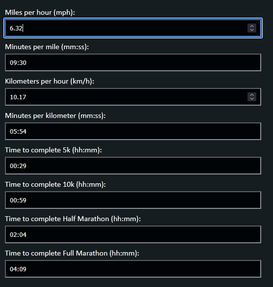

# Running Calculator 🏃‍♀️🏃‍♂️

Use this free running pace calculator to instantly convert between miles per hour, kilometers per hour, minutes per mile, and minutes per kilometer. Automatically calculates your estimated finish times for 5K, 10K, half marathon, and full marathon races based on your current pace. You can even start by entering in your desired finish times, and it will backwards-calculate your required speeds. Any textbox can be your starting point.

If you choose to start by entering a desired time into any of the competition distances at the bottom, the calculator will highlight the distance you are targeting. So if you go and change your speed in any of the other fields, it will remain highlighting your targeted race distance.

Be mindful to follow each field's label format, as they are mostly all different (mm:ss) vs (hh:mm) for example.

The reset button at the bottom can be helpful if you run into any formatting issues or need to start over. The reset button kindly remembers what distance you were targeting, so it will continue to bold your ideal time even after starting over.

Finally, a word of caution: If you are on mobile, and are experiencing any issues with updating a field's data, the reset button is your friend (a quirk with some on-screen keyboards / browsers).

## [Calculate your run now](https://benrogerswpg.github.io/running-calculator/) 🥇

### Example:

